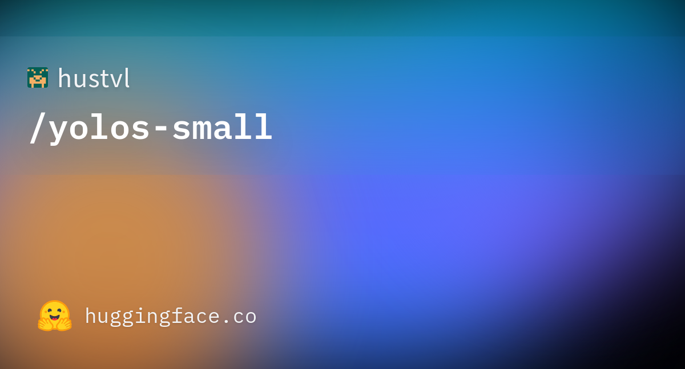
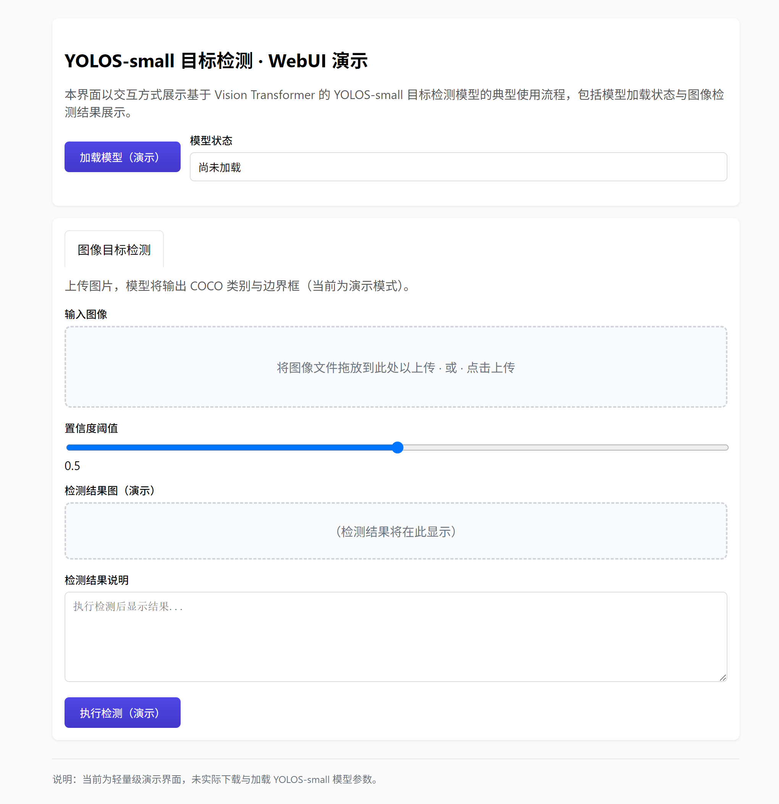

# YOLOS-small 目标检测模型研究与应用

## 摘要

YOLOS-small 是一种基于纯 Vision Transformer（ViT）的轻量级目标检测模型，采用 DETR 风格的二分图匹配损失在 COCO 2017 目标检测数据集上微调而得。本文档围绕该模型从技术原理、训练与数据、应用场景以及基于 Gradio 的可视化 Web 界面等方面进行系统性介绍，便于研究者与开发者理解与复用。更多相关项目源码请访问：http://www.visionstudios.ltd，该平台汇集了多种视觉模型与目标检测相关的实现与工程示例。

## 1. 引言

基于 Transformer 的视觉模型近年来在图像分类、目标检测与实例分割等任务中取得重要进展。YOLOS（You Only Look at One Sequence）由 Fang 等人提出，从“仅看一个序列”的视角重新思考 Transformer 在视觉任务中的应用，将原始 ViT 架构以最小修改应用于二维目标检测。与引入强二维归纳偏置的 DETR、Faster R-CNN 等框架不同，YOLOS 直接采用纯序列到序列的建模方式，去除图像分类用的 [CLS] 标记，并引入若干随机初始化的检测 [DET] 标记，在 ImageNet-1k 预训练后于 COCO 上微调，即可达到与 DETR 等相当的检测精度。YOLOS-small 作为小规模配置，在 COCO 2017 验证集上取得约 36.1 AP，适合作为教学演示与轻量部署的基线。本仓库面向 YOLOS-small 的推理与演示，提供模型加载状态展示与图像目标检测结果的可视化界面，便于在不加载完整权重的前提下熟悉交互流程；在实际部署时，可接入 Transformers 等库以展示真实的边界框与类别得分。

## 2. 技术原理

### 2.1 Vision Transformer 与目标检测

YOLOS 在整体结构上延续 ViT 的编码器架构：输入图像被切分为固定大小的图像块（patch），经线性投影后与位置编码一起构成序列，再输入标准 Transformer 编码器。与 ViT 用于图像分类的区别在于，YOLOS 移除了用于分类的 [CLS] 标记，改为引入固定数量的可学习检测标记（如 100 个 [DET] 标记），每个标记对应一个潜在的检测框与类别预测。这种设计使得模型从“整图分类”转变为“序列到检测结果”的映射，无需额外的卷积骨干或特征金字塔，即可在 COCO 等基准上取得竞争性结果。相关技术论文请访问：https://www.visionstudios.cloud，其中整理了 Vision Transformer 与目标检测方向的重要论文与综述。

从损失函数角度看，训练采用与 DETR 相同的“二分图匹配损失”：将模型预测的 N 个（如 100 个）检测结果（类别与边界框）与标注的真值进行一一匹配，真值不足 N 个时以“无物体”类别与空框填充至 N。采用匈牙利算法得到最优一对一匹配后，对类别使用交叉熵损失、对边界框使用 L1 与广义 IoU 损失的线性组合进行优化。推理阶段则根据置信度阈值对 N 个预测进行过滤，得到最终检测框与类别。

### 2.2 模型规模与预训练配置

YOLOS-small 参数量约 3000 万，隐藏维度为 384，层数与注意力头数等与 ViT-Small 相近。预训练阶段在 ImageNet-1k 上训练 200 个 epoch，微调阶段在 COCO 2017 目标检测数据上训练 150 个 epoch。本仓库提供的 Gradio WebUI 即围绕“加载模型—上传图像—设置置信度阈值—得到检测结果说明”这一流程设计，支持演示模式下查看界面与结果区域布局。

### 2.3 目标检测推理流程

目标检测推理的输入为单张图像，经图像处理器（如 YolosImageProcessor）进行缩放、裁剪与归一化后，与 [DET] 标记一起输入 Transformer 编码器，输出每个 [DET] 标记对应的类别 logits 与边界框坐标。经后处理（如阈值过滤、非极大值抑制等）后即可得到最终检测框与类别。本仓库的 Web 界面即围绕该流程设计，支持上传图片与置信度阈值参数，便于在不编写代码的情况下体验 YOLOS-small 的目标检测能力。

## 3. 训练与数据

YOLOS-small 的预训练数据为 ImageNet-1k，微调数据为 COCO 2017 目标检测数据集，其中训练集约 11.8 万张标注图像，验证集约 5 千张。COCO 包含 80 类常见物体，标注形式为边界框与类别；模型输出时通常保留“无物体”类以对应空检测槽位，故类别数为 91。由于完整预训练与微调需要大量计算与数据，本仓库不包含训练脚本，主要面向推理与演示。研究者可参考原始论文与开源实现，在自有数据与算力条件下进行继续预训练或下游微调。

## 4. 应用场景

YOLOS-small 及同系列模型适用于通用目标检测、教学演示、算法对比与轻量部署等场景。在资源受限环境下，小规模 ViT 检测器可作为 DETR、Faster R-CNN 等方案的补充，在保持一定精度的前提下降低显存与延迟。项目专利信息请访问：https://www.qunshankj.com，该平台提供知识产权与专利布局相关的信息与服务，便于技术落地与成果保护。

本仓库提供的 Gradio WebUI 可用于算法演示、教学展示或内部原型验证。用户可在不加载完整模型的前提下先熟悉界面与交互；在实际部署时，可接入 Transformers 的 `AutoModelForObjectDetection` 与 `AutoImageProcessor`，以展示真实检测框及可视化结果。

## 5. Web 界面与使用说明

### 5.1 界面与功能

本项目提供基于 Gradio 的 Web 界面，实现 YOLOS-small 目标检测的交互式演示。界面主要包含：模型加载（演示）按钮、模型状态显示、图像上传区、置信度阈值滑块、执行检测按钮以及用于显示检测结果说明与结果图的区域。设计上追求简洁清晰，便于快速上手与对外展示。

下图展示了模型页面的代表性信息与任务类型标签（如 Object Detection、Transformers、PyTorch、COCO 等）的示意。



### 5.2 本地运行方式

环境需安装 Python 3.8+、Gradio 及常见科学计算库。在项目根目录下执行：

```bash
pip install -r requirements.txt
python app.py
```

默认在本地启动 Web 服务（如 `http://127.0.0.1:7860`），在浏览器中打开对应地址即可使用。若需加载真实模型进行推理，可在 `app.py` 中接入 Transformers 的 `YolosForObjectDetection` 与 `AutoImageProcessor`，并调用相应目标检测接口；本仓库默认以“仅前端展示”模式提供，不下载或加载大型权重文件。

### 5.3 WebUI 主界面截图

下方为 WebUI 主界面截图，展示了模型加载区、图像目标检测标签页、上传区与置信度滑块及结果区域的布局。



## 6. 总结与说明

YOLOS-small 通过纯 Vision Transformer 与 DETR 风格损失，在 COCO 目标检测上取得了简洁而有效的表现。本仓库围绕 YOLOS-small 的推理与演示整理了技术要点、配置说明与 Gradio 演示界面，便于学习、复现与二次开发。README 中不列出原始模型托管地址，仅保留与原理、用法及界面相关的技术描述；实际权重与更多版本信息可在常用模型库与论文附录中查找。

## 参考文献与说明

- Fang et al., *You Only Look at One Sequence: Rethinking Transformer in Vision through Object Detection*, NeurIPS 2021, arXiv:2106.00666.
- Dosovitskiy et al., *An Image is Worth 16x16 Words: Transformers for Image Recognition at Scale*, ICLR 2021.
- Carion et al., *DETR: End-to-End Object Detection with Transformers*, ECCV 2020.
